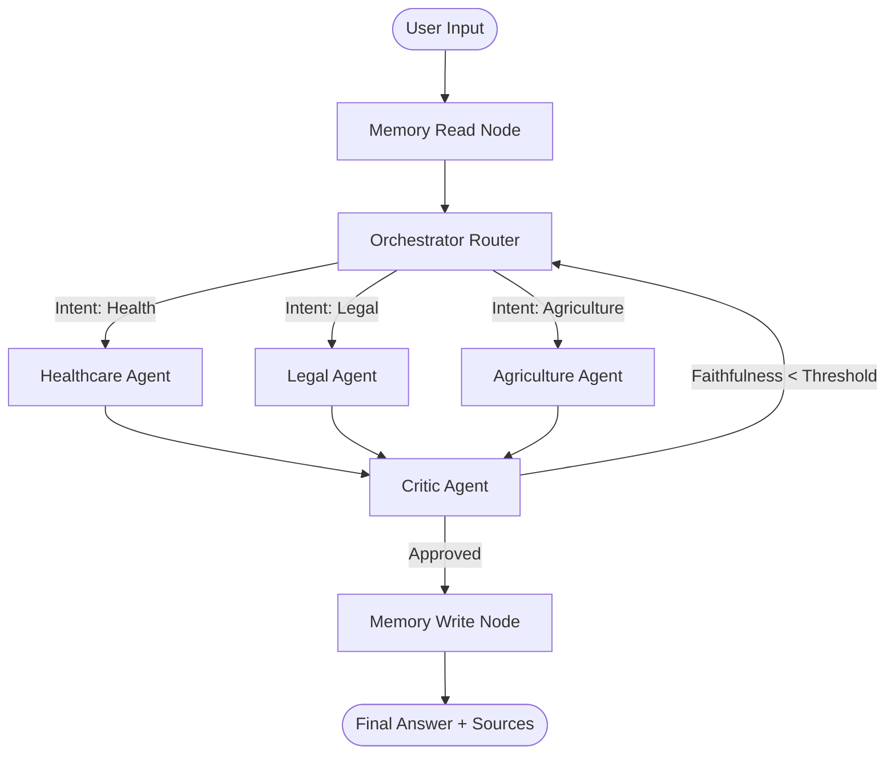

# TriSeva: A Multi-Agent Retrieval-Augmented System for Explainable Cross-Domain Document Question Answering across Healthcare, Legal/Government, and Agriculture Domains

TriSeva is an explainable, end-to-end multi-agent AI assistant designed to provide grounded and transparent decision support across three vital domains: **Healthcare**, **Legal/Government Schemes**, and **Agriculture**.

Built with **LangGraph** for orchestrating complex state-driven workflows, **Chainlit** for a modern conversational interface, and **ChromaDB** for knowledge retrieval, TriSeva achieves transparency and Explainable AI (XAI) through source attribution, similarity match scoring, real-time agent workflow tracing, and comprehensive developer audit logs.

---

## 🏗️ Architecture & Workflow

TriSeva utilizes a directed cyclic graph workflow implemented using **LangGraph** to coordinate routing, agent cooperation, critique loops, and chat memory persistence.



### Key Workflow Components

1. **Memory Read & Write**: Restores user conversation history at the start of a session and saves updated states at the end of the execution flow using a thread-aware checkpointer.
2. **Orchestrator (Router)**: Uses a local/fine-tuned **DistilBERT classifier** to analyze user query intents and classify them into one of the three domains (Healthcare, Legal, or Agriculture).
3. **Domain Agents**:
   - **Healthcare Agent**: Handles medical queries, explains health parameters, and diagnoses symptom descriptions.
   - **Legal Agent**: Assesses eligibility for government programs, interprets legal regulations, and searches legal codes.
   - **Agriculture Agent**: Advises on crop protection, farming techniques, soil health, and agricultural resources.
4. **Critic / Reviewer Agent**: Evaluates the domain agent's draft answer against retrieved context chunks to calculate a **Faithfulness/Factual Alignment Score**. If the score falls below the required threshold, it flags the issue and routes the query back to the orchestrator for refinement (retry loop).

---

## 🛠️ Tool Suite

Each specialist agent is equipped with tools to query external resources, compute equations, or process rich media:

- **RAG Tool**: Queries a local **ChromaDB** vector database populated with domain-specific textbooks, manuals, and PDFs. Uses custom sentence-transformers embeddings and a custom chunker (`knowledge_base/chunker.py`).
- **Vision Tool**: Integrates a multimodal LLM to parse text, charts, or images uploaded by users.
- **Search Tool**: Integrates the **Tavily Search API** to fetch live information from the web if local vector retrieval is insufficient.
- **Calculator Tool**: Runs safe numerical evaluations to prevent LLM calculation hallucinations.

---

## 📊 Performance Evaluation & Benchmarking Results

TriSeva is evaluated using **Ragas** (Retrieval Augmented Generation Assessment) to benchmark response quality and retrieval relevance on a curated Q&A dataset of domain-specific questions.

### 1. Overall System Metrics
Over a 500-question benchmark dataset evaluating accuracy, response quality, and document retrieval precision, TriSeva achieved the following results:

| Metric | Score | Description |
| :--- | :--- | :--- |
| **Faithfulness / Factual Alignment** | **68.2%** | Measures how factually grounded the agent's answer is in the retrieved document context. |
| **Answer Relevancy** | **42.0%** | Measures how directly the generated answer addresses the user's question without adding fluff. |

### 2. Baseline Comparisons
To validate the effectiveness of our LangGraph routing and critic agent architecture, TriSeva is benchmarked against three distinct baseline configurations over the 500-question dataset (comprising 166 health, 166 legal, and 168 agriculture questions):

| Architecture Configuration | Faithfulness Score | Answer Relevancy | Avg Latency | Description |
| :--- | :---: | :---: | :---: | :--- |
| **TriSeva (Multi-Agent + Critic)** | **68.2%** | 42.0% | 10.31s | **Full system**: DistilBERT routing, specialist agents, and RAG/Search tools with critic checks. |
| **B1 — Naive RAG (Cross-Domain)** | 66.5% | **49.4%** | 4.85s | **No routing**: Queries all three ChromaDB collections directly and picks the top-scoring chunks. |
| **B2 — No Critic Loop** | 61.4% | **49.9%** | **3.88s** | **Critic disabled**: Runs the standard graph flow but bypasses the re-query/retry loop by setting `MAX_RETRIES = 0` while keeping `FAITHFULNESS_THRESHOLD = 0.7` constant. |
| **B3 — Keyword Search (BM25)** | 65.3% | 48.8% | 4.12s | **Lexical search**: Replaces semantic vector search with keyword-based BM25 retrieval (`rank_bm25`). |

#### Key Insights from Benchmarking:
* **The Value of Domain Routing (B1 vs. TriSeva)**: Scoped domain routing improves faithfulness from **66.5% to 68.2%** over unrouted naive retrieval (B1). By pre-classifying query intent and routing it to the dedicated collection, TriSeva prevents cross-domain context dilution (e.g. retrieving legal/land tenure context for an agricultural crop planning question).
* **The Value of the Critic Loop (B2 vs. TriSeva)**: Disabling the critic feedback loop (B2) drop-scores faithfulness from **68.2% to 61.4%** (a **6.8% decrease**). This confirms that the LangGraph critique-reflection retry loop successfully catches and filters out ungrounded assertions, formatting hallucinations, and factual errors before answers are served.
* **Semantic Vector Search vs. BM25 (B3 vs. TriSeva)**: Semantic vector search outperforms BM25 lexical retrieval by **2.9%** (improving faithfulness from **65.3% to 68.2%**). Vector search successfully captures synonym mappings and conceptual alignments that simple keyword overlap checks miss.

---

## 💻 Frontend User Interfaces

TriSeva provides three options for interacting with the multi-agent system:

### 1. Chainlit UI (Primary, Rebranded)
- **Primary Interface**: Booted via `app/chainlit_app.py`.
- **ChatGPT Aesthetic**: Features a customized layout including a flat, pure white interface, borderless/bubble-free chat sections, a light-grey floating chatbox capsule, a black circular send button, and a clean sidebar list.
- **Data Persistence**: Uses a local SQLite database (`chainlit.db`) for user authentication and thread history.
- **Interactive Steps**: Displays domain icons, domain classification logs, retrieved source files with relevance scores, and faithfulness checks.

### 2. Streamlit UI (Secondary)
- **Secondary Interface**: Booted via `app/streamlit_app.py`.
- **Clean Layout**: A simpler, responsive dashboard layout with sidebar navigation.

### 3. Gradio UI (Playground)
- **Interactive Sandbox**: Booted via `app/gradio_app.py` for debugging and testing raw model properties.

---

## 📂 Project Directory Structure

```plaintext
Triseva/
├── agents/                 # Multi-agent LangGraph nodes and configurations
│   ├── orchestrator.py     # Intent classification and routing node
│   ├── health_agent.py     # Healthcare expert agent
│   ├── legal_agent.py      # Law & government schemes agent
│   ├── agri_agent.py       # Agriculture advice agent
│   ├── critic.py           # Answer validator/refinement loop
│   ├── state.py            # LangGraph state schema definition
│   └── train_router.py     # Router training script using DistilBERT
├── app/                    # UI Application code
│   ├── .chainlit/          # Chainlit-specific configuration files
│   ├── public/             # Static UI assets (logos, favicons, custom CSS)
│   ├── chainlit_app.py     # Primary Chainlit application entrypoint
│   ├── streamlit_app.py    # Streamlit application UI
│   └── gradio_app.py       # Gradio playground UI
├── evaluation/             # Ragas evaluation and benchmarking scripts
│   ├── baseline_b1_naive.py     # B1 Baseline: Cross-domain naive retrieval
│   ├── baseline_b2_nocritic.py  # B2 Baseline: Threshold 0.0 (no retries)
│   ├── baseline_b3_keyword.py   # B3 Baseline: BM25 lexical retriever
│   ├── baseline_rag.py          # Domain-specific single agent naive baseline
│   ├── curate_dataset.py        # Dataset curation script
│   ├── ragas_eval.py            # Ragas verification metrics pipeline
│   └── results/                 # Benchmarking output CSV/JSON logs
├── knowledge_base/         # Local database management
│   ├── build_kb.py         # Parses documents and populates ChromaDB
│   └── chunker.py          # Custom sentence-level text chunking
├── tools/                  # Agent tool definitions (RAG, Web Search, Calculator, Vision)
├── main.py                 # Core LangGraph graph compiler and CLI test script
├── triseva_scrapper.py     # Web scrapper for local resource gathering
└── requirements.txt        # Python dependency manifest
```

---

## 🚀 Setup & Execution

### Prerequisites
1. Install Python 3.10 or 3.11.
2. Create and activate a virtual environment:
   ```bash
   python -m venv venv
   source venv/bin/activate  # On Windows: venv\Scripts\activate
   ```
3. Install dependencies:
   ```bash
   pip install -r requirements.txt
   ```
4. Configure your environment variables in a `.env` file in the root directory:
   ```env
   OPENAI_API_KEY=your_openai_api_key
   TAVILY_API_KEY=your_tavily_api_key
   GEMINI_API_KEY=your_gemini_api_key
   ```

### 1. Running the Primary Chainlit UI
To launch the rebranded, premium ChatGPT-style UI on port 8001:
```bash
chainlit run app/chainlit_app.py --port 8001
```
Open **[http://localhost:8001](http://localhost:8001)** in your web browser.

### 2. Running Streamlit / Gradio
```bash
streamlit run app/streamlit_app.py
# OR
python app/gradio_app.py
```

### 3. Running CLI Verification
To run a batch validation of the orchestrator, domain agents, and critic loops directly in the terminal:
```bash
python main.py
```

### 4. Running Baselines & Benchmarks
To test the individual baseline pipelines in your terminal:
```bash
# Run B1 Naive RAG (Cross-Domain)
python evaluation/baseline_b1_naive.py

# Run B2 No Critic Loop
python evaluation/baseline_b2_nocritic.py

# Run B3 Keyword Search (BM25)
python evaluation/baseline_b3_keyword.py

# Run Ragas Evaluation Suite
python evaluation/ragas_eval.py
```
