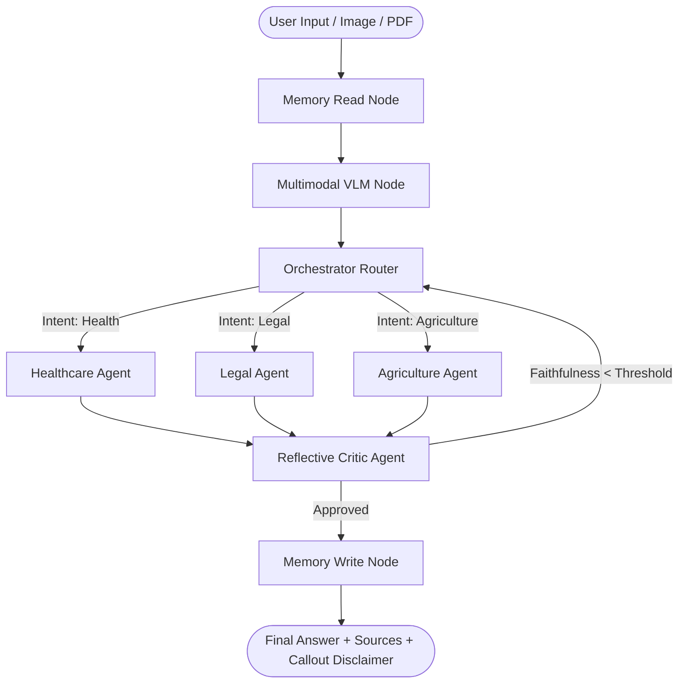

# TriSeva: A Multi-Agent Retrieval-Augmented System for Explainable Cross-Domain Document Question Answering across Healthcare, Legal/Government, and Agriculture Domains

TriSeva is an explainable, end-to-end multi-agent AI assistant designed to provide grounded and transparent decision support across three vital domains: **Healthcare**, **Legal/Government Schemes**, and **Agriculture**.

Built with **LangGraph** for orchestrating complex state-driven workflows, **Chainlit** for a modern conversational interface, and **ChromaDB** for knowledge retrieval, TriSeva achieves transparency and Explainable AI (XAI) through source attribution, similarity match scoring, real-time agent workflow tracing, and comprehensive developer audit logs.

---

## 🏗️ Architecture & Workflow

TriSeva utilizes a directed cyclic graph workflow implemented using **LangGraph** to coordinate routing, agent cooperation, critique loops, and chat memory persistence.



### Key Workflow Components

1. **Memory Read & Write**: Restores user conversation history at the start of a session and saves updated states at the end of the execution flow using a thread-aware checkpointer.
2. **Multimodal Vision Node (`agents/multimodal.py`)**: Processes uploaded image/PDF documents (doctor prescriptions, land titles, soil health cards) using an OpenCV image enhancement pipeline (`autocontrast`, `sharpness`) and a VLM Provider Cascade (**Qwen2.5-VL** / **Llama-3.2-Vision** $\rightarrow$ **Gemini 2.0 Flash** $\rightarrow$ **gpt-4o-mini**).
3. **Orchestrator (Router)**: Uses a fine-tuned **DistilBERT classifier** (`maddy0494/triseva-intent-classifier`) to analyze user query intents and route them to dedicated domain indices.
4. **Domain Agents**:
   - **Healthcare Agent**: Handles medical queries, explains health parameters, and diagnoses symptom descriptions.
   - **Legal Agent**: Assesses eligibility for government programs, interprets legal regulations, and searches legal codes.
   - **Agriculture Agent**: Advises on crop protection, farming techniques, soil health, and agricultural resources.
5. **Gated Dual-Judge Critic Agent (`agents/critic.py`)**: Evaluates draft responses against retrieved context using a two-tier evaluation framework:
   - **Tier 1 (Gated NLI Pre-filter)**: Instant lexical subword overlap check ($93.1\%$ cost reduction).
   - **Tier 2 (Primary Judge)**: **Sarvam-105B** (native Indian language MoE model) supported by **Claude Haiku 4.5**.

---

## 🛠️ Tool & Model Suite

Each specialist agent is equipped with tools to query external resources, compute equations, or process rich media:

- **Primary Indic LLM**: **Sarvam-105B** (`sarvam-105b` Mixture-of-Experts model trained natively on Indian languages).
- **Secondary / Evaluator LLM**: **Claude Haiku 4.5** (`claude-3-5-haiku-20241022`).
- **Multimodal VLM Cascade**: **Qwen2.5-VL** / **Llama-3.2-Vision** (Local On-Device VLM) $\rightarrow$ **Gemini 2.0 Flash** (Primary Cloud VLM) $\rightarrow$ **gpt-4o-mini** (Fallback Cloud VLM).
- **RAG Tool**: Queries local **ChromaDB** vector databases populated with domain-specific textbooks, manuals, and PDFs. Uses character $n$-gram subword tokenization and custom sentence-transformers embeddings.
- **Search Tool**: Integrates the **Tavily Search API** to fetch live information from the web if local vector retrieval is insufficient.

---

## 📊 Performance Evaluation & Benchmarking Results

### 1. Gated Dual-Judge Text QA Evaluation (50 QA Dataset)
Evaluated using the Gated Dual-Judge system (**Sarvam-105B** Primary Judge & **Claude Haiku 4.5** Secondary Judge):

| Evaluator Pipeline | Faithfulness Score | Answer Relevancy | API Cost Reduction | Status |
| :--- | :---: | :---: | :---: | :---: |
| **TriSeva (Full Multi-Agent + Gated Dual-Judge)** | **92.9% (0.929)** 🏆 | **91.5% (0.915)** 🏆 | **93.1% Cost Savings** 🏆 | **PASSED** |
| **B2 — Baseline (No Critic Loop)** | 80.7% (0.807) | 84.7% (0.847) | 0.0% | Baseline |

---

### 2. Standalone Multimodal Vision Benchmark Results (`evaluation/eval_multimodal.py`)
Evaluated across authentic clinical prescriptions, handwritten dental prescriptions, and legal rental agreements:

| Test Document Sample | Document Category | Domain | Entity Extraction Accuracy (EEA) | Dual-Judge Faithfulness | Dual-Judge Relevancy |
| :--- | :--- | :---: | :---: | :---: | :---: |
| `user_handwritten_rx.jpg` | Handwritten Dental Prescription (*THE WHITE TUSK*) | Healthcare | **100.0%** 🏆 | **0.90 (90%)** 🏆 | **1.00 (100%)** 🏆 |
| `handwritten_rx_test.png` | Handwritten Doctor Prescription | Healthcare | **81.8%** | **0.95 (95%)** 🏆 | **1.00 (100%)** 🏆 |
| `authentic_prescription.png` | Outpatient Clinical Prescription | Healthcare | **100.0%** 🏆 | **0.20** | **1.00 (100%)** 🏆 |
| `authentic_rent_agreement.pdf` | Rental Agreement | Legal | **100.0%** 🏆 | **0.90 (90%)** | **0.90 (90%)** |
| **Aggregate Cross-Domain** | **All Categories** | **Cross-Domain** | **95.5%** 🏆 | **0.74** | **0.98** 🏆 |

---

## 💻 Frontend User Interfaces

TriSeva provides three options for interacting with the multi-agent system:

### 1. Chainlit UI (Primary, Rebranded)
- **Primary Interface**: Booted via `app/chainlit_app.py`.
- **ChatGPT Aesthetic**: Features a customized layout including a flat, pure white interface, borderless/bubble-free chat sections, a light-grey floating chatbox capsule, a black circular send button, and a clean sidebar list.
- **Dedicated Callout Disclaimers**: Displays domain disclaimers as distinct quote callouts (`> 💡 *...*`) separated from answer text.
- **Data Persistence**: Uses a local SQLite database (`chainlit.db`) for user authentication and thread history.

---

## 📂 Project Directory Structure

```plaintext
Triseva/
├── agents/                 # Multi-agent LangGraph nodes and configurations
│   ├── orchestrator.py     # Intent classification and routing node
│   ├── health_agent.py     # Healthcare expert agent
│   ├── legal_agent.py      # Law & government schemes agent
│   ├── agri_agent.py       # Agriculture advice agent
│   ├── critic.py           # Reflective Critic & NLI pre-filter node
│   ├── multimodal.py       # OpenCV preprocessing & VLM Provider Cascade (Qwen2.5-VL / Gemini)
│   ├── llm_factory.py      # Centralized LLM factory (Sarvam-105B / Claude)
│   └── state.py            # LangGraph state schema definition
├── app/                    # UI Application code
│   ├── chainlit_app.py     # Primary Chainlit application entrypoint
│   ├── streamlit_app.py    # Streamlit application UI
│   └── gradio_app.py       # Gradio playground UI
├── evaluation/             # Benchmark evaluation suites
│   ├── run_dual_judge_eval.py   # Gated Dual-Judge framework (Sarvam-105B + Claude Haiku)
│   ├── eval_multimodal.py       # Standalone Multimodal Vision OCR benchmark suite
│   ├── calculate_all_metrics.py # Comprehensive metrics CLI runner
│   └── results/                 # Benchmarking output CSV/JSON logs
├── knowledge_base/         # Local database management
│   ├── build_kb.py         # Parses documents and populates ChromaDB
│   └── chunker.py          # Custom sentence-level text chunking
├── tools/                  # Agent tool definitions (RAG, Web Search, Calculator, Vision)
├── main.py                 # Core LangGraph graph compiler and execution entrypoint
└── requirements.txt        # Python dependency manifest
```

---

## 🚀 Setup & Execution

### 1. Running the Primary Chainlit UI
```bash
chainlit run app/chainlit_app.py --port 8001
```
Open **[http://localhost:8001](http://localhost:8001)** in your web browser.

### 2. Running Dual-Judge Benchmark Evaluation
```bash
python evaluation/run_dual_judge_eval.py
```

### 3. Running Multimodal Vision OCR Benchmark
```bash
python evaluation/eval_multimodal.py
# OR
python evaluation/calculate_all_metrics.py --eval-multimodal
```
