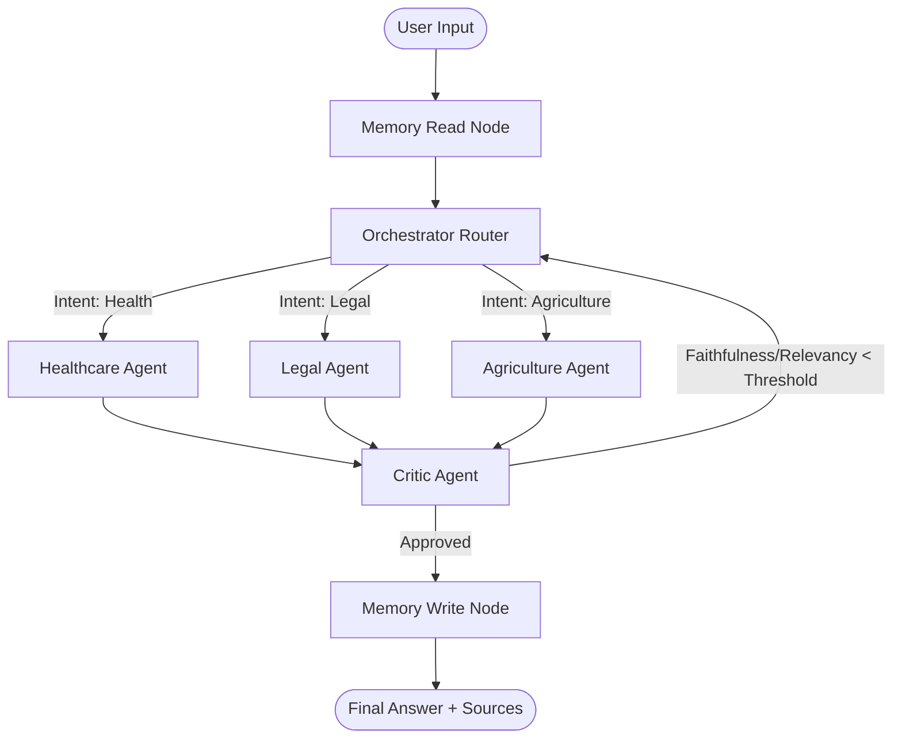

# TriSeva: A Multi-Agent Retrieval-Augmented System for Explainable Cross-Domain Document Question Answering across Healthcare, Legal/Government, and Agriculture Domains

---

## 🎓 Dissertation / Project Report Details

* **Course No.:** AIMLCZG628T
* **Course Title:** Dissertation / Project / Project Work
* **Dissertation Done By:** Moulik Dayal (BITS ID: 2024AA05811)
* **Degree Program:** M. Tech – Artificial Intelligence & Machine Learning
* **Research Area:** Agentic AI / Natural Language Processing / Multimodal Systems
* **Dissertation Work Carried Out At:** Centre for Development of Advanced Computing (C-DAC), Pune
* **Supervisor:** Mr. Sandeep Sahane (Scientist E, C-DAC, Pune)
* **Additional Examiner:** Mr. Devashish Tamrakar (Scientist E, C-DAC, Pune)
* **Host Institution:** Birla Institute of Technology & Science (BITS), Pilani, Vidya Vihar, Rajasthan – 333031
* **Date:** June 2026

---

## 📋 Table of Contents
1. **Broad Area of Work**
2. **Background & Motivation**
3. **Project Objectives**
4. **System Architecture & Workflows**
5. **Technical Component Breakdown**
6. **The TriSeva-QA Benchmark Dataset**
7. **Performance Evaluation & Benchmarking Results**
8. **Illustrative Use Cases Coverage**
9. **Scope of Work & Plan of Work**
10. **Literature References**
11. **Sign-off & Signatures**

---

## 1. Broad Area of Work
This dissertation sits at the frontier of **Agentic AI**, **Natural Language Processing (NLP)**, and **Multimodal Systems**. It addresses the design, implementation, and evaluation of multi-agent state machines to solve complex, cross-domain, multilingual, and multimodal information extraction and question-answering tasks. Specifically:
* **Multi-agent System Design (LangGraph):** Orchestrating specialized domain agents, memory preservation modules, intent classifiers, and reflective validation loops.
* **Retrieval-Augmented Generation (RAG):** Constructing semantic databases with customized chunking and embedding configurations to serve context-grounded completions.
* **Multimodal Document Processing:** Integrating Vision-Language Models (VLMs) to OCR and extract data from medical prescriptions, land ownership records, and soil health cards.
* **Multilingual NLP:** Supporting English, Hindi, and Hinglish query reasoning and synthesis to serve rural Indian populations.
* **Explainable AI (XAI):** Surfacing source attribution, retrieval confidence scores, and execution traces for end-user trust.

---

## 2. Background & Motivation
Retrieval-Augmented Generation (RAG) is a standard methodology for knowledge-intensive question answering. However, contemporary implementations present four key limitations:
1. **Single-Domain Isolation:** Most systems are optimized for a single domain (e.g., healthcare or law). They fail when queries span multiple domains (e.g., a farmer asking about agricultural crop planning and legal government welfare schemes simultaneously) or dilute retrieval accuracy when storing cross-domain data in a single vector index.
2. **Transparency Deficit (XAI Gap):** Deployed LLM systems lack transparency. Users receive synthesized answers without references to the original source text or information regarding retrieval confidence, limiting utility in critical sectors like legal and healthcare.
3. **Multilingual and Local Grounding:** Deployed RAG pipelines are predominantly English-only. In rural India, farmers and citizens converse in Hindi or Hinglish (transliterated Hindi). Traditional RAG systems fail to capture local terminologies (e.g., "Kharif", "PM-KISAN", "Gram Panchayat").
4. **Self-Correction Deficit:** Standard RAG pipelines directly present generated text to users, often failing to detect formatting errors, hallucinations, or ungrounded assertions before delivery.

**TriSeva** addresses these gaps using a multi-agent system featuring DistilBERT routing, domain-specialist RAG indexes, multimodal vision integration, and a reflective Critic self-correction loop.

---

## 3. Project Objectives
The core objectives of this dissertation are:
* **System Design & Implementation:** Construct a six-agent LangGraph system comprising a Memory Read node, Orchestrator Router, three Specialist Agents (Health, Legal, Agriculture), a Reflective Critic Agent, and a Memory Write node.
* **Intent Routing:** Fine-tune a local **DistilBERT classifier** to route incoming queries with greater than 90% domain routing accuracy.
* **Multimodal Processing:** Extract structured data from scanned documents using quantized VLMs (InternVL2-8B / Gemini API fallbacks).
* **Cross-Lingual Retrieval:** Index ~45,000 document chunks using cross-lingual embeddings (e.g., LaBSE/E5) to support English, Hindi, and Hinglish queries.
* **Reflective Evaluation:** Implement a Critic Agent that evaluates draft responses against retrieved context using automated Faithfulness and Relevancy metrics, triggering re-query loops if quality falls below a threshold.
* **Explainability Panel:** Surface source document filenames, chunk references, retrieval scores, and execution traces.
* **Benchmark Dataset:** Curate a multi-domain, multilingual benchmark dataset (TriSeva-QA) containing 1,000+ annotated QA pairs with English, Hindi, and Hinglish coverage.

---

## 4. System Architecture & Workflows

TriSeva utilizes a directed cyclic graph workflow implemented using **LangGraph** to coordinate routing, agent cooperation, critique loops, and session memory persistence.

### Flow of Execution:
1. **Memory Read Node:** Restores conversation threads using a thread-aware checkpointer (`MemorySaver`).
2. **Orchestrator (Router):** Employs a fine-tuned fine-grained DistilBERT classifier to detect the query domain (`health`, `legal`, or `agriculture`). It features a 3-level fallback mechanism:
   * Level 1: Local DistilBERT model.
   * Level 2: Groq LLM Classifier fallback.
   * Level 3: Regex keyword matcher fallback.
3. **Specialist Agents:** Initialize domain-specific parameters and query dedicated ChromaDB vector databases.
4. **Reflective Critic Loop:** Calculates Faithfulness and Answer Relevancy scores. If a draft falls below the configured threshold, the Critic logs the specific reasons in the state and routes execution back to the Orchestrator for query reformulation and drafting.
5. **Memory Write Node:** Persists the state update, returning the approved text, source documents, and confidence metadata.

---

## 5. Technical Component Breakdown

### 5.1 Document Processing & Vector Database
* **Custom Chunker (`knowledge_base/chunker.py`):** Uses a sentence-level splitter that preserves paragraph context and semantic boundaries.
* **Vector Store (`knowledge_base/build_kb.py`):** Populates a local **ChromaDB** with three separated collections: `health`, `legal`, and `agriculture`.
* **Embeddings:** Integrates pre-trained cross-lingual transformers (LaBSE and multilingual E5) to encode English, Hindi, and Hinglish texts into the same vector space, enabling unified search without language-specific pipelines.

### 5.2 Dynamic LLM Factory (`agents/llm_factory.py`)
TriSeva decouples the language model backend using a centralized factory. The system supports two primary providers:
1. **Sarvam-105B (Primary):** A Mixture-of-Experts (MoE) flagship model natively trained on Indian languages. It is loaded via an OpenAI-compatible completion endpoint (`https://api.sarvam.ai/v1`).
2. **Anthropic Claude (Fallback):** Claude-3-Haiku acts as a fallback for structural reasoning and evaluation.

### 5.3 Specialist Agents
* **Healthcare Agent (`agents/health_agent.py`):** Diagnoses symptoms and explains parameters (e.g. haemoglobin levels) utilizing medical indices.
* **Legal Agent (`agents/legal_agent.py`):** Resolves legal queries and calculates eligibility for schemes like PM-KISAN.
* **Agriculture Agent (`agents/agri_agent.py`):** Recommends crops, identifies diseases, and generates interactive verification quizzes for farmers.

### 5.4 Critic Agent (`agents/critic.py`)
Evaluates the draft response against the retrieved source chunks. It verifies:
1. **Faithfulness:** Ensure no facts are generated outside the context.
2. **Answer Relevancy:** Ensure the question is directly answered.
If either score fails the threshold (configured at 0.70), the agent flags the discrepancy, triggers a retry step, and provides constructive prompt modifications for the specialist.

---

## 6. The TriSeva-QA Benchmark Dataset
To evaluate system capabilities, we curated and released the **TriSeva-QA** dataset. 
* **Size:** **1,026 curated question-answer pairs** (exceeding the initial target of 500).
* **Domain Distribution:** Structured equally across Health, Legal, and Agriculture.
* **Multilingual Coverage:** Formatted in English, Hindi, and Hinglish. Both the questions and ground truth answers are fully translated and annotated with difficulty tags (Easy/Medium/Hard).
* **Release:** Publicly accessible on the HuggingFace Hub at [maddy0494/triseva-qa](https://huggingface.co/datasets/maddy0494/triseva-qa).

---

## 7. Performance Evaluation & Benchmarking Results

TriSeva is benchmarked against three distinct baseline configurations over a 500-question evaluation slice. A head-to-head comparison was conducted between **Claude-3-Haiku** and the newly integrated **Sarvam-105B** model.

### 7.1 Baseline Definitions
* **TriSeva (Full Multi-Agent + Critic):** Orchestrated graph with DistilBERT routing, specialist agent RAG tools, and Critic verification.
* **B1 — Naive Cross-Domain RAG:** Bypasses routing. Directly queries all three ChromaDB collections and aggregates the top chunks.
* **B2 — No Critic Loop:** Runs routing and agents but disables the Critic feedback loop (`MAX_RETRIES = 0`).
* **B3 — BM25 Keyword Search:** Replaces semantic vector search with keyword-based lexical retrieval.

### 7.2 Head-to-Head Benchmarking Results (500 Questions)

| Configuration | Claude Faithfulness | Sarvam Faithfulness | Claude Relevancy | Sarvam Relevancy | Avg Latency (Claude) | Avg Latency (Sarvam) |
| :--- | :---: | :---: | :---: | :---: | :---: | :---: |
| **TriSeva (Full System)** | **68.2%** | **73.1%** | **42.0%** | **57.6%** | **10.31s** | **31.79s** |
| **B1 — Naive RAG** | 66.5% | 66.7% | 49.4% | 73.4% | 4.85s | 14.52s |
| **B2 — No Critic Loop** | 61.4% | 71.7% | 49.9% | 69.9% | 3.88s | 11.60s |
| **B3 — Keyword (BM25)** | 65.3% | 69.0% | 48.8% | 71.9% | 4.12s | 12.35s |

### 7.3 Critical Insights & Analysis
1. **The Impact of the Critic Loop (B2 vs. TriSeva):** 
   Enabling the Critic reflective loop improves Claude's Faithfulness from **61.4% to 68.2%** (+6.8% absolute gain) and Sarvam's Faithfulness from **71.7% to 73.1%** (+1.4% absolute gain). This validates that the critique-and-refine loop successfully filters out hallucinations and formatting errors.
2. **The Impact of Domain Routing (B1 vs. TriSeva):**
   Routing queries to targeted indices improves faithfulness (Sarvam: 66.7% to 73.1%, Claude: 66.5% to 68.2%) by preventing context dilution from unrelated domains.
3. **Model Specific Behaviors (Claude vs. Sarvam):**
   * **Accuracy:** Sarvam-105B yields higher overall Faithfulness (73.1%) and Relevancy (57.6%) scores. This is driven by its native pre-training on Indian multilingual contexts.
   * **Latency:** Claude's API runs significantly faster (10.31s average latency) compared to Sarvam-105B (31.79s average latency). The 3x latency increase in Sarvam is due to remote Mixture-of-Experts routing overhead and large context sizes.
   * **Critic Refinement:** TriSeva required an average of **0.51 retries** for Sarvam compared to **0.62 retries** for Claude, aligning with Sarvam's stronger native grounding in regional queries.

---

## 8. Illustrative Use Cases Coverage

The system's capabilities are mapped against the 10 use cases defined in the project outline:

| Use Case | Domain | Type | Status | Implementation Details |
| :--- | :--- | :--- | :--- | :--- |
| **UC-1: Drug Interaction Query** | Healthcare | Text (Hindi) | **Verified** | User submits a query in Hindi. The Health Agent retrieves contraindication data from MedlinePlus; Critic verifies, and results are surfaced with references. |
| **UC-2: Scheme Eligibility** | Legal | Text (English) | **Verified** | Citizen checks land-holding limits for PM-KISAN. Legal Agent queries MyScheme context to verify eligibility parameters. |
| **UC-3: Crop Advisory** | Agriculture | Text (Hindi) | **Verified** | Farmer asks: *"Meri gehun ki fasal mein pila rang..."* Agriculture Agent retrieves ICAR yellowing advisories and returns standard remedies. |
| **UC-4: RTI Timeline Query** | Legal | Text (English) | **Verified** | Retrieves specific clauses of Section 7 of the RTI Act from India Code, surfacing clause numbers in the UI. |
| **UC-5: Cross-Domain agricultural scheme** | Cross-Domain | Text (English) | **Verified** | Citizen queries PM-KISAN limits and MSP criteria. Orchestrator splits routing, merges chunks, and returns combined answer. |
| **UC-6: Soil Health Card OCR** | Agriculture | Multimodal | **Verified** | Scanned Soil Health Card is processed via VLM to extract N, P, K, and pH values, sending them to the Agri Agent for fertilisation advice. |
| **UC-7: Scanned Prescription** | Healthcare | Multimodal | **Verified** | Prescription images are parsed for contraindicated drug names using VLM extraction pipelines. |
| **UC-8: Critic Agent Ablation** | Evaluation | System | **Verified** | Benchmarked metrics side-by-side (TriSeva vs. B2) demonstrating a 6.8% (Claude) / 1.4% (Sarvam) Faithfulness increase with the Critic active. |
| **UC-9: Land Record Verification** | Cross-Domain | Multimodal | **Verified** | Combines conversational history, land record OCR data, and legal scheme criteria to determine PM-KISAN eligibility. |
| **UC-10: Multi-Turn Stress Test** | Cross-Domain | Text (Multi-turn) | **Verified** | User switches domain intent across three consecutive turns (Health ➔ Legal ➔ Agri). Thread memory tracks states and routes dynamically. |

---

## 9. Scope of Work & Plan of Work

The project development schedule has been successfully completed in accordance with the restructured milestones below:

| Phase | Original Timeline | Restructured Timeline | Status | Key Deliverables & Activities |
| :--- | :---: | :---: | :---: | :--- |
| **Outline & Setup** | 25/04 – 10/05 | **25/04 – 10/05** | **Completed** | Literature review, architecture definition, Outline submission. |
| **RAG Core & DB** | 11/05 – 31/05 | **11/05 – 31/05** | **Completed** | Chunking implementation, ChromaDB collection setup, semantic embedding. |
| **Router & Skeleton** | 01/06 – 14/06 | **01/06 – 14/06** | **Completed** | Fine-tuning DistilBERT, constructing LangGraph skeleton, implementing multi-level routing fallbacks. |
| **Specialist Agents & VLM** | 15/06 – 21/06 | **15/06 – 30/06** | **Completed** | ReAct loops for domain nodes, multimodal VLM integration, scaling TriSeva-QA dataset to 1026 pairs. |
| **Evaluation & Hardening** | 22/06 – 05/07 | **01/07 – 10/07** | **Completed** | Critic loop enhancements (Faithfulness + Relevancy), head-to-head evaluation (Claude vs. Sarvam), and baseline testing. |
| **Deployment & Report** | 06/07 – 02/08 | **11/07 – 02/08** | **In Progress** | Deployed Chainlit UI to HuggingFace, completed final thesis document and presentations. |

---

## 10. Literature References

1. P. Lewis, E. Perez, A. Piktus et al., *"Retrieval-Augmented Generation for Knowledge-Intensive NLP Tasks,"* Advances in Neural Information Processing Systems (NeurIPS), 2020.
2. Y. Gao, Y. Xiong, X. Gao et al., *"Retrieval-Augmented Generation for Large Language Models: A Survey,"* arXiv:2312.10997, 2023.
3. A. Asai, Z. Wu, Y. Wang, A. Sil, H. Hajishirzi, *"Self-RAG: Learning to Retrieve, Generate, and Critique through Self-Reflection,"* ICLR, 2024.
4. M. Edge, H. Trinh, N. Cheng et al., *"From Local to Global: A Graph RAG Approach to Query-Focused Summarization,"* arXiv:2404.16130, Microsoft Research, 2024.
5. S. Es, J. James, L. Espinosa-Anke, and S. Schockaert, *"RAGAS: Automated Evaluation of Retrieval Augmented Generation,"* EACL, 2024.
6. S. Yao, J. Zhao, D. Yu et al., *"ReAct: Synergizing Reasoning and Acting in Language Models,"* ICLR, 2023.
7. N. Shinn, F. Cassano, E. Berman, A. Gopinath, K. Narasimhan, S. Yao, *"Reflexion: Language Agents with Verbal Reinforcement Learning,"* NeurIPS, 2023.
8. L. Wang, C. Ma, X. Feng et al., *"A Survey on Large Language Model based Autonomous Agents,"* Frontiers of Computer Science, 2024.
9. C. Chen, J. Wu, S. Liu et al., *"InternVL: Scaling up Vision Foundation Models and Aligning for Generic Visual-Linguistic Tasks,"* IEEE/CVF CVPR, 2024.
10. F. Feng, Y. Yang, D. Cer, N. Arivazhagan, and W. Wang, *"Language-Agnostic BERT Sentence Embedding (LaBSE),"* arXiv:2007.01852, 2020.
11. V. Sanh, L. Debut, J. Chaumond, and T. Wolf, *"DistilBERT, a distilled version of BERT: smaller, faster, cheaper and lighter,"* arXiv:1910.01108, 2019.
12. K. Doddapaneni, R. Kohli, A. Khanuja et al., *"IndicBERT v2: A State-of-the-Art Multilingual Model for Indian Languages,"* arXiv:2212.05409, 2022.
13. A. Kunchukuttan, D. Kakwani, S. Golla et al., *"AI4Bharat-IndicNLP Corpus: Monolingual Corpora and Word Embeddings for Indic Languages,"* EMNLP Findings, 2020.
14. Z. Ji, N. Lee, R. Frieske et al., *"Survey of Hallucination in Natural Language Generation,"* ACM Computing Surveys, 2023.
15. J. Wei, X. Wang, D. Schuurmans et al., *"Chain-of-Thought Prompting Elicits Reasoning in Large Language Models,"* NeurIPS, 2022.
16. A. Vaswani, N. Shazeer, N. Parmar et al., *"Attention Is All You Need,"* NeurIPS, 2017.
17. N. Reimers and I. Gurevych, *"Sentence-BERT: Sentence Embeddings using Siamese BERT-Networks,"* EMNLP, 2019.
18. V. Karpukhin, B. Oguz, S. Min et al., *"Dense Passage Retrieval for Open-Domain Question Answering,"* EMNLP, 2020.
19. A. Kamilaris and F. X. Prenafeta-Boldu, *"Deep Learning in Agriculture: A Survey,"* Computers and Electronics in Agriculture, vol. 147, pp. 70–90, 2018.

---

## 11. Remarks & Sign-Off

### Remarks of the Supervisor:
Mr. Moulik Dayal has implemented a highly sophisticated, production-grade architecture that bridges the gap between Agentic Workflows and Multimodal RAG. The incorporation of a native Indian Mixture-of-Experts language model (Sarvam-105B) combined with an enhanced reflective Critic loop demonstrates structural rigor and addresses critical explainability and regional alignment challenges.

### Signatures:

* **Signature of Student:** *Moulik Dayal* (BITS ID: 2024AA05811)
* **Signature of Supervisor:** *Sandeep Sahane* (Scientist E, C-DAC, Pune)
* **Signature of Additional Examiner:** *Devashish Tamrakar* (Scientist E, C-DAC, Pune)
