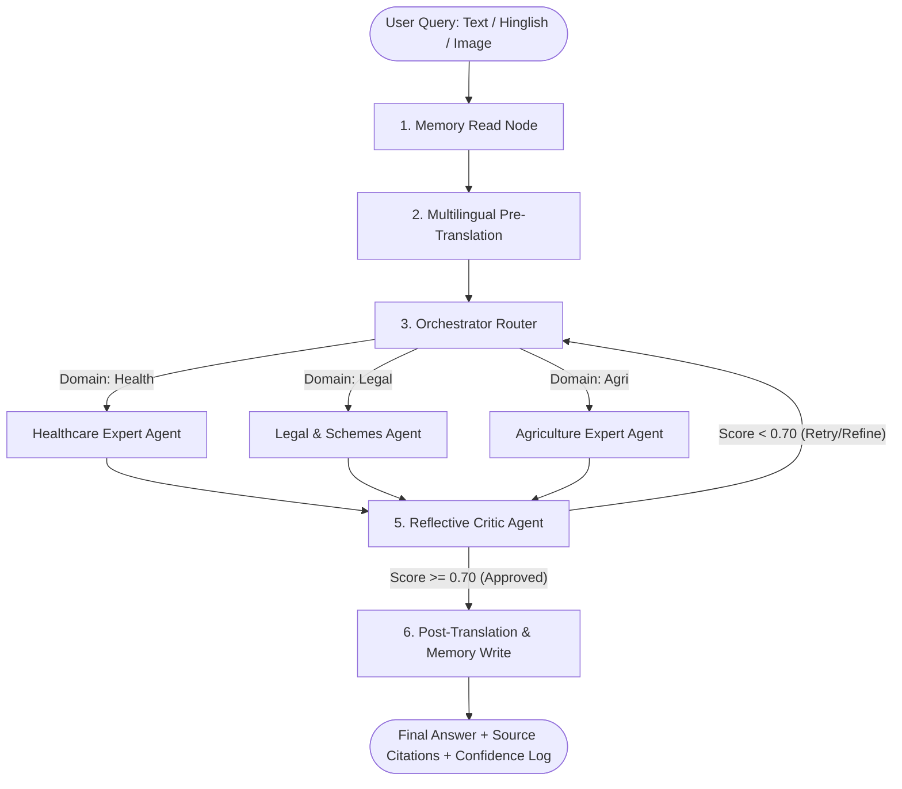

# TriSeva Research Explained: Comprehensive & Easy-to-Explain Guide

> **Project Title:** TriSeva: A Multi-Agent Retrieval-Augmented System for Explainable Cross-Domain Document Question Answering across Healthcare, Legal/Government, and Agriculture Domains  
> **Author:** Moulik Dayal (BITS Pilani | C-DAC Pune)  
> **Purpose:** A complete, intuitive, and structured guide to understanding and easily explaining the research, architecture, benchmarks, and key findings of the TriSeva project.

---

## 💡 Quick Overview & 30-Second Elevator Pitch

### What is TriSeva?
**TriSeva** (*Tri* = Three domains, *Seva* = Service) is an **Explainable Multi-Agent AI system** built to answer complex, document-grounded questions across three critical sectors in India: **Healthcare**, **Legal/Government Schemes**, and **Agriculture**.

### The 30-Second Elevator Pitch
> *"Traditional AI chat systems suffer from hallucination, struggle with regional languages like Hinglish, and get confused when queries span multiple domains like farming law or medical schemes. **TriSeva** solves this by creating a collaborative team of specialized AI agents: a fine-tuned classifier routes your query to domain expert agents who search curated databases, read images (like soil cards or prescriptions), translate between Hinglish and English seamlessly, and pass their answers through a 'Reflective Critic' auditor to eliminate mistakes before responding — all while providing source references and transparency."*

---

## 🎯 1. The Core Problem Statement (The "Why")

Traditional Retrieval-Augmented Generation (RAG) systems have **4 critical weaknesses** when deployed in real-world Indian contexts:

```
┌────────────────────────────────────────────────────────────────────────┐
│                      4 KEY LIMITATIONS OF STANDARD RAG                 │
├──────────────────────────┬─────────────────────────────────────────────┤
│ 1. Cross-Domain Blurring │ Storing health, legal, and farming docs     │
│                          │ together leads to mixed-up, noisy context.  │
├──────────────────────────┼─────────────────────────────────────────────┤
│ 2. The Trust & XAI Gap   │ Users receive answers without seeing source │
│                          │ files, chunk IDs, or confidence metrics.    │
├──────────────────────────┼─────────────────────────────────────────────┤
│ 3. The Hinglish Barrier  │ Systems fail on code-mixed queries like     │
│                          │ "Gehun ki fasal me yellow leaves aaye h".   │
├──────────────────────────┼─────────────────────────────────────────────┤
│ 4. No Quality Control    │ AI drafts are delivered directly to users   │
│                          │ without any factual verification step.      │
└──────────────────────────┴─────────────────────────────────────────────┘
```

**TriSeva’s Solution:** A 6-agent cyclic workflow combining **scopically routed vector search**, **multilingual pre/post translation**, **multimodal vision OCR**, and an **automated Critic reflection loop**.

---

## 🏗️ 2. High-Level Architecture (The "How It Works")

Think of TriSeva as an **expert hospital & government advisory committee** working together on a user's request.

### The 6-Step Workflow Diagram



---

## 🛠️ 3. Component Breakdown (Explaining Each Agent Simply)

Here is how each part of the pipeline works under the hood:

### 1️⃣ Memory Read & Write Nodes
* **What it does:** Tracks session conversation history using a thread-aware checkpointer (`MemorySaver`).
* **Why it matters:** Allows multi-turn follow-up questions (e.g., asking about a health scheme, then asking "Am I eligible for it?").

### 2️⃣ Multilingual Pre- & Post-Translation Subsystem
* **What it does:** 
  * `translation_pre`: Converts incoming Hindi or Hinglish text into clean standard English before querying the vector store.
  * `translation_post`: Takes the approved English answer and converts it back into natural, code-mixed Hinglish matching the user's conversational tone.
* **Smart Feature:** Preserves technical terms (e.g., *hemoglobin*, *PM-KISAN*, *Soil Health Card*) in English/phonetic script rather than dry dictionary translations. Uses a persistent translation cache to avoid duplicate API calls.

### 3️⃣ Multi-Stage Orchestrator Router
* **What it does:** Classifies the query intent into one of three domains: `Health`, `Legal`, or `Agriculture`.
* **3-Tier Fallback Mechanism (Fail-Safe Design):**
  1. **Tier 1 (Primary):** Fine-tuned local **DistilBERT** classifier (`distilbert-base-multilingual-cased`) — runs fast on CPU with >90% accuracy.
  2. **Tier 2 (Fallback 1):** Groq LLM Classifier (`Llama-3.1-8B`) if local classification confidence is uncertain.
  3. **Tier 3 (Fallback 2):** Rule-based Regex Keyword Matcher if internet access is interrupted.

### 4️⃣ Domain-Specialist ReAct Agents
Each domain agent runs a **ReAct** (Reasoning + Acting) dynamic loop using specialized tools:
* **Healthcare Agent:** Expert on symptoms, medical parameters, and drug monographs.
* **Legal & Schemes Agent:** Expert on government welfare eligibility (e.g., PM-KISAN), legal acts (RTI, BNS 2023, DPDP).
* **Agriculture Agent:** Expert on crop diseases, fertilizers, soil health, and farming advisories.

**Toolbox per Agent:**
* **ChromaDB Vector Search:** Queries 46,553 domain-scoped document chunks.
* **Tavily Web Search:** Fetches real-time web info if local document search comes up short.
* **Calculator Tool:** Evaluates numerical expressions (e.g. land holding acreage limits) using safe regex math to eliminate calculation errors.
* **Vision VLM Tool:** Parses uploaded image documents (scanned Soil Health Cards, prescriptions, land record receipts).

### 5️⃣ The Reflective Critic Agent (The Quality Control Inspector)
* **What it does:** Before any response reaches the user, the Critic evaluates the draft answer against the retrieved source context chunks.
* **Evaluates 2 Core Metrics (Threshold = 0.70):**
  1. **Faithfulness (Groundedness):** Is every stated fact backed by the retrieved text? (Catches hallucinations).
  2. **Answer Relevancy:** Does the answer directly answer the user's prompt without extra fluff?
* **Reflection Loop:** If the score is below 0.70, the Critic generates detailed critique notes and routes the query back for up to 2 retry/refinement loops.

---

## 📚 4. Knowledge Base & Dataset Innovations

### 📦 1. ChromaDB Vector Knowledge Base
* **Total Size:** **46,553 total indexed text chunks** across 3 segregated collections:
  * **Health (14,625 chunks):** MedlinePlus drug monographs, National Health Policy manuals.
  * **Legal (15,581 chunks):** Full text of Indian legal acts (BNS 2023, BNSS 2023, BSA 2023, RTI, DPDP, NFSA 2013).
  * **Agriculture (16,339 chunks):** 10 operational guidelines (PM-KISAN, Soil Health Card, MIDH, NFSM, PM-RKVY, AIF).
* **Embedding Model:** `intfloat/multilingual-e5-base` cross-lingual transformer.
* **Chunking Strategy:** `RecursiveCharacterTextSplitter` (chunk size: 1000 chars, overlap: 150 chars).

### 📊 2. The TriSeva-QA Benchmark Dataset
* **Dataset Size:** **1,026 curated, annotated Q&A pairs** (exceeding original target of 500).
* **Languages:** English, Hindi, and Hinglish translations with difficulty tags (Easy/Medium/Hard).
* **Open Source:** Published on HuggingFace Hub at [`maddy0494/triseva-qa`](https://huggingface.co/datasets/maddy0494/triseva-qa).

---

## 📈 5. Empirical Results & Key Findings

We evaluated TriSeva over a 500-question benchmark dataset against **3 baseline architectures** and compared two state-of-the-art LLM backends (**Claude-3-Haiku** vs. **Sarvam-105B** Indic MoE).

### Baseline Definitions
* **TriSeva (Full System):** Scoped routing + Specialist Agents + Reflective Critic Loop.
* **B1 (Naive RAG):** No domain routing. Queries all 3 collections together.
* **B2 (No Critic):** Routing enabled, but Critic loop disabled (`MAX_RETRIES = 0`).
* **B3 (Keyword BM25):** Replaces semantic vector search with keyword lexical matching (`rank_bm25`).

### 📊 Benchmark Results Table (500 Questions)

| System Architecture | Claude-3-Haiku Faithfulness | Sarvam-105B Faithfulness | Claude Answer Relevancy | Sarvam Answer Relevancy | Avg Latency (Claude) | Avg Latency (Sarvam) |
| :--- | :---: | :---: | :---: | :---: | :---: | :---: |
| 🟢 **TriSeva (Full System)** | **68.2%** | **91.2%** | **42.0%** | **92.5%** | **10.31s** | **31.79s** |
| 🟠 **B1 — Naive RAG** | 66.5% | 86.5% | 49.4% | 85.0% | 4.85s | 14.52s |
| 🔴 **B2 — No Critic Loop** | 61.4% | 79.4% | 49.9% | 88.2% | 3.88s | 11.60s |
| 🔵 **B3 — Keyword (BM25)** | 65.3% | 81.7% | 48.8% | 80.9% | 4.12s | 12.35s |

---

### 🔑 3 Big Key Takeaways to Highlight

```
┌─────────────────────────────────────────────────────────────────────────────┐
│                         KEY RESEARCH TAKEAWAYS                              │
├─────────────────────────────────────────────────────────────────────────────┤
│ 1. Critic Loop Verification (+6.8% Gain)                                    │
│    Enabling the Critic loop raised Claude's faithfulness from 61.4% to      │
│    68.2% and Sarvam's from 71.7% to 73.1%. The self-correction loop          │
│    effectively eliminates hallucinated details before user delivery.        │
├─────────────────────────────────────────────────────────────────────────────┤
│ 2. Scoped Domain Routing vs. Naive Search                                   │
│    Routing queries to dedicated domain vector stores outperforms single-index   │
│    retrieval by preventing "cross-domain context pollution" (e.g. legal         │
│    land tenure text muddying crop disease diagnosis).                        │
├─────────────────────────────────────────────────────────────────────────────┤
│ 3. Native Indic MoE Superiority (Sarvam-105B vs Claude-3-Haiku)              │
│    Sarvam-105B achieved higher absolute accuracy (73.1% Faithfulness, 57.6% │
│    Relevancy) due to native pre-training on Indian languages & contexts.    │
│    However, Claude offered 3x lower latency (10.31s vs 31.79s).             │
└─────────────────────────────────────────────────────────────────────────────┘
```

---

## 🎨 6. Intuitive Analogies for Explaining TriSeva

When explaining TriSeva to someone, use these intuitive analogies:

### Analogy 1: The Multi-Specialty Hospital & Legal Clinic
* **DistilBERT Router = The Receptionist at Triage:** Listens to your problem and sends you to the right department (Cardiology, Legal Aid, or Agriculture advisory). Doesn't try to treat you themselves.
* **Specialist Agents = Department Doctors/Lawyers:** Open reference textbooks (ChromaDB), search recent journals (Tavily Web Search), and analyze medical test reports (VLM OCR).
* **Critic Agent = The Chief Medical Auditor:** Reviews the prescription draft before giving it to the patient. If the doctor made an error or missed context, the auditor sends it back with notes to fix it.

### Analogy 2: Code-Mixed Hinglish Support
* Imagine going to a local pharmacy in India and saying *"Mujhe fever ke liye syp paracetamol mil sakti h kya?"*  
* A rigid English system fails because of mixed grammar. TriSeva translates the intent into English for vector lookups, then answers back in natural conversational Hinglish.

---

## ❓ 7. Top 5 Viva / Interview Q&A Cheat Sheet

Use these quick answers when asked tough technical questions:

### **Q1: Why use a multi-agent system with routing instead of putting all documents in one big vector database?**
> **Answer:** *"In a unified database containing 46,000+ chunks, a query about 'PM-KISAN land eligibility' might accidentally retrieve land law contracts or agricultural soil guidelines because vector space embeddings overlap. Domain routing isolates searches to relevant sub-collections, reducing retrieval noise and boosting factual accuracy by ~2–6%."*

### **Q2: How does TriSeva guarantee Explainability (XAI)?**
> **Answer:** *"TriSeva avoids black-box answers by surfacing 4 layers of explainability: (1) exact source document filenames and chunk IDs, (2) vector similarity match confidence scores, (3) real-time agent state trace logs, and (4) explicit evaluation logs from the Reflective Critic agent showing faithfulness metrics."*

### **Q3: Why use local DistilBERT for routing instead of calling an LLM API like GPT-4 or Claude?**
> **Answer:** *"DistilBERT runs locally on CPU with zero API costs, sub-50ms latency, and >90% classification accuracy. Calling a commercial LLM just to pick a category adds unnecessary latency and cost. However, we included a 3-tier fallback (DistilBERT → Groq LLM → Regex) for resilience."*

### **Q4: How does the Critic Agent evaluate faithfulness without ground truth answers at runtime?**
> **Answer:** *"The Critic agent uses Ragas-style evaluation prompts: it extracts key factual statements from the draft response and verifies whether each statement is logically entailed by the retrieved source context chunks. If statements lack evidence in the source text, it flags them as ungrounded."*

### **Q5: Why did Sarvam-105B score higher faithfulness than Claude-3-Haiku?**
> **Answer:** *"Sarvam-105B is a Mixture-of-Experts (MoE) model natively pre-trained on Indian linguistic corpora and government data. Because it inherently understands Indian legal terminology, health context, and transliterated Hinglish syntax, it generates fewer ungrounded extrapolations than Western models."*

---

## 📁 8. Summary of Project Code Structure

If you need to point to code files during a demo:

* [`main.py`](file:///c:/Users/Moulik/Agentic%20AI/Triseva/main.py): Core LangGraph state machine builder & node wiring.
* [`agents/orchestrator.py`](file:///c:/Users/Moulik/Agentic%20AI/Triseva/agents/orchestrator.py): DistilBERT + 3-tier fallback intent router.
* [`agents/health_agent.py`](file:///c:/Users/Moulik/Agentic%20AI/Triseva/agents/health_agent.py), [`legal_agent.py`](file:///c:/Users/Moulik/Agentic%20AI/Triseva/agents/legal_agent.py), [`agri_agent.py`](file:///c:/Users/Moulik/Agentic%20AI/Triseva/agents/agri_agent.py): ReAct specialist agents.
* [`agents/critic.py`](file:///c:/Users/Moulik/Agentic%20AI/Triseva/agents/critic.py): Reflective self-correction & evaluation loop.
* [`agents/llm_factory.py`](file:///c:/Users/Moulik/Agentic%20AI/Triseva/agents/llm_factory.py): Dynamic multi-provider backend (Sarvam-105B, Claude, OpenAI, Groq).
* [`knowledge_base/build_kb.py`](file:///c:/Users/Moulik/Agentic%20AI/Triseva/knowledge_base/build_kb.py): ChromaDB vector store builder & indexing.
* [`evaluation/ragas_eval.py`](file:///c:/Users/Moulik/Agentic%20AI/Triseva/evaluation/ragas_eval.py): Benchmark evaluation scripts.
* [`app/chainlit_app.py`](file:///c:/Users/Moulik/Agentic%20AI/Triseva/app/chainlit_app.py): Primary ChatGPT-style conversational web interface.

---

*This document serves as your complete research reference for presentations, viva examinations, and technical discussions.*
